# End-to-End Data Flows — Enterprise Customer Support AI Platform

**Document:** End-to-End Data Flows  
**Version:** 1.0  
**Status:** Draft  
**Derived from:** System Architecture V1.0, Use Case Specifications V1.0  
**Part of:** System Architecture Series (Step 3 of 5)

---

## 1. Purpose and Scope

This document defines how data moves through the platform end-to-end for every major flow. It covers:

- Data entering the system (inputs and their schemas)
- Transformations at each component boundary
- What is written to which store at each step
- Data exiting the system (response, notification, audit record)
- Asynchronous continuation flows
- Supporting infrastructure flows (ingestion, approval timeout, evaluation)

These diagrams are the primary input to API contract design, database schema decisions, and integration design.

---

## 2. Notation

```
─────►   Synchronous call (waits for response)
- - -►   Asynchronous message (fire-and-forget / queued)
═════►   Data written to store
◄─────   Response returned
[data]   Payload at this point in the flow
{store}  Data store (PostgreSQL, Redis, Vector Store)
```

**Participants used across diagrams:**

| Short Name | Full Name |
|---|---|
| C | Customer |
| API | Support API (FastAPI) |
| AG | Agent Service |
| BM25 | BM25 index (lexical retrieval) |
| VS | Vector Store (pgvector) |
| RR | Reranker |
| LLM | LLM Abstraction → Ollama → model |
| PG | PostgreSQL |
| RD | Redis |
| WK | Worker Service (Celery) |
| EP | Email Provider |
| HA | Human Support Agent |
| OT | OpenTelemetry Collector |

---

## 3. Flow 1 — Simple FAQ (UC-01)

The baseline synchronous flow: retrieval + grounded generation, no tool calls, no auth required.

### 3.1 Sequence Diagram

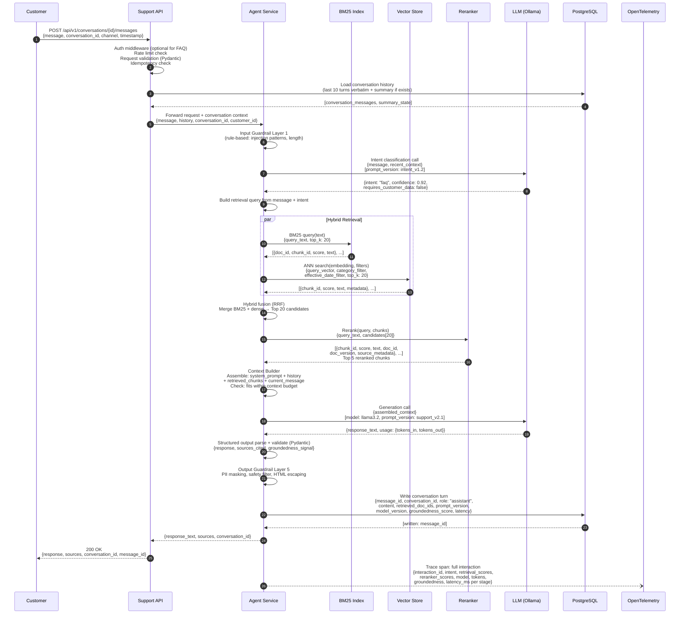

### 3.2 Data Written Per Step

| Step | Store | Data Written |
|---|---|---|
| 1 | API logs | Request received, request_id |
| PG load | PostgreSQL | Read only |
| BM25 | In-memory index | Read only |
| VS | Vector Store | Read only |
| PG write | PostgreSQL | `conversation_messages`: role, content, retrieved_doc_ids, prompt_version, model_version, groundedness_score, latency |
| OTel | OTel backend | Full trace span with all metadata |

### 3.3 Data Transformations

```
Raw message (text)
      │
      ▼ [Intent classification]
{intent, confidence, requires_customer_data}
      │
      ▼ [Retrieval query construction]
{query_text, query_vector, metadata_filters}
      │
      ├──► BM25 → [{doc_id, chunk_id, bm25_score, text}]
      └──► Dense → [{chunk_id, dense_score, text, metadata}]
                │
                ▼ [Hybrid fusion RRF]
      [{chunk_id, fused_score, text, source_metadata}] × 20
                │
                ▼ [Reranker]
      [{chunk_id, rerank_score, text, source_metadata}] × 5
                │
                ▼ [Context assembly]
      {system_prompt + history + chunks + message} (token budget checked)
                │
                ▼ [LLM]
      {response_text, usage}
                │
                ▼ [Output guardrails]
      {response_text_clean, sources_cited}
```

---

## 4. Flow 2 — Order Status (UC-02)

Authenticated customer reads order data through tool call. No writes to business data.

### 4.1 Sequence Diagram

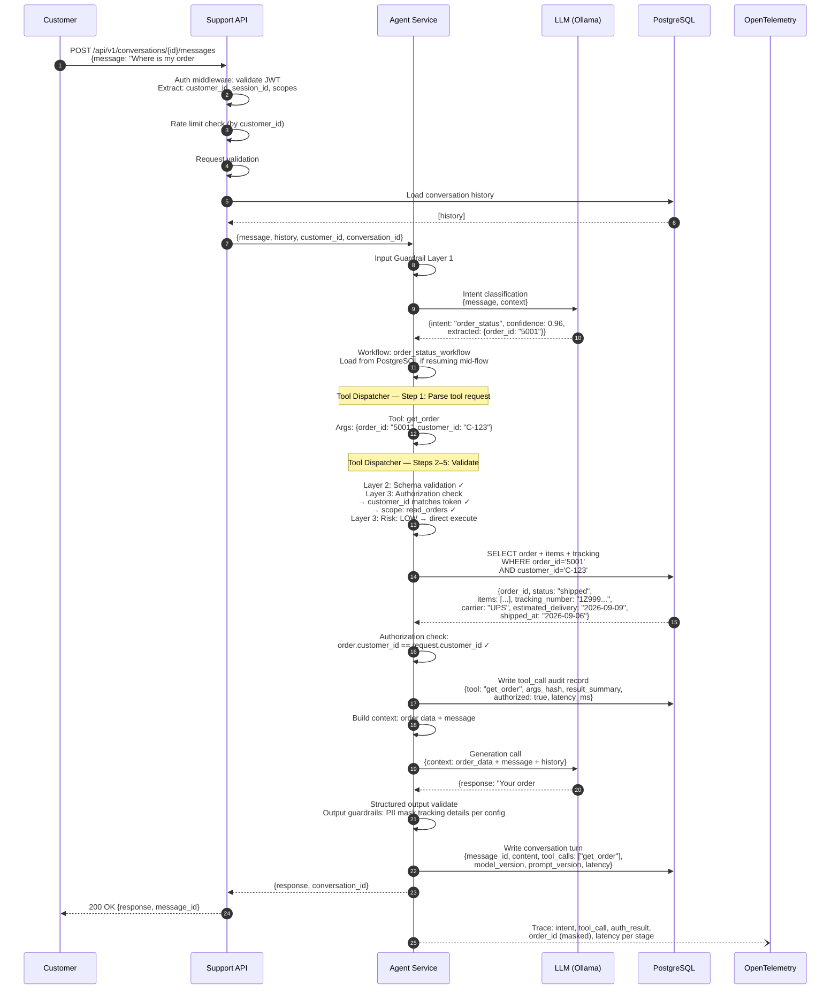

### 4.2 Authorization Data Flow

```
JWT token  ──────►  Auth middleware  ──────►  {customer_id, scopes, session_id}
                                                          │
                                                          ▼
                                              Tool Dispatcher
                                              scope check: read_orders ✓
                                                          │
                                                          ▼
                                              PostgreSQL query
                                              WHERE customer_id = token.customer_id
                                              (DB-level ownership enforcement)
                                                          │
                                                          ▼
                                              Agent-level check:
                                              result.customer_id == token.customer_id
                                              (double-check, defense in depth)
```

---

## 5. Flow 3 — Refund Request (UC-04)

The most complex synchronous→asynchronous flow. Two distinct phases: the synchronous API turn (ends with approval requested), and the asynchronous approval + execution continuation.

### 5.1 Phase 1 — Synchronous: Request to Approval Pending

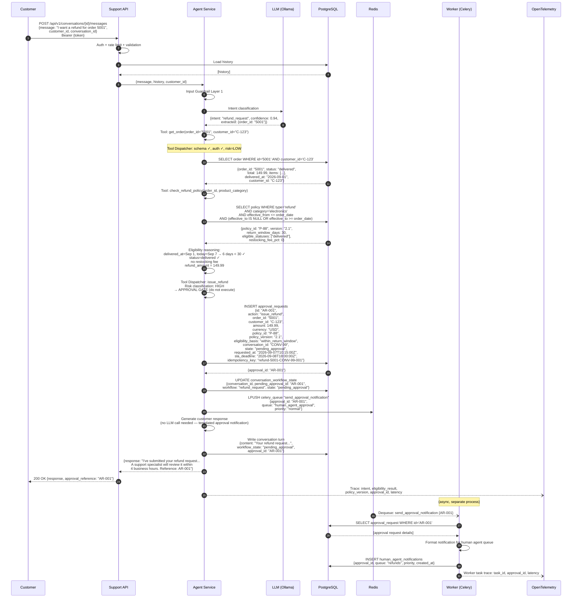

### 5.2 Phase 2 — Asynchronous: Human Decision to Execution

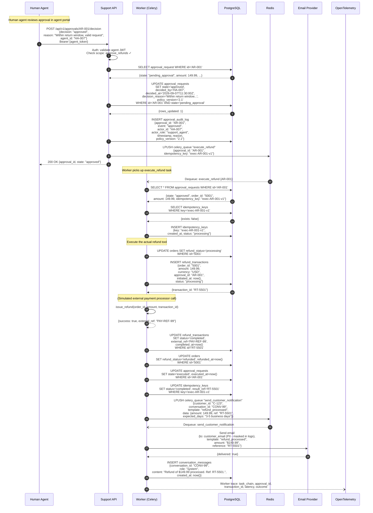

### 5.3 Approval Timeout Flow

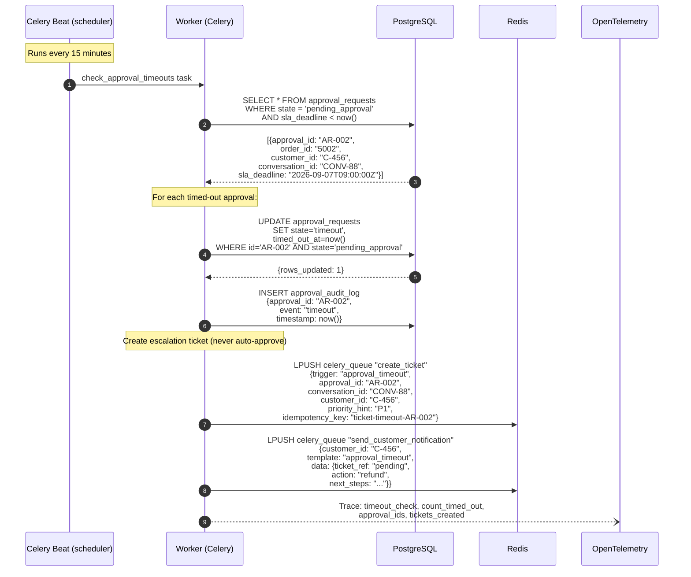

### 5.4 Data Written — Refund Flow Summary

| Phase | Store | Table / Key | Data |
|---|---|---|---|
| Sync (approval gate) | PostgreSQL | `approval_requests` | Full approval record, policy version, SLA deadline |
| Sync (approval gate) | PostgreSQL | `conversation_workflow_state` | Pending approval ID, workflow state |
| Sync (approval gate) | PostgreSQL | `conversation_messages` | Customer-facing response |
| Sync (approval gate) | Redis | Celery queue | `send_approval_notification` task |
| Async (notification) | PostgreSQL | `human_agent_notifications` | Approval in agent queue |
| Human decision | PostgreSQL | `approval_requests` | Decision, actor, timestamp, reason |
| Human decision | PostgreSQL | `approval_audit_log` | Full audit trail |
| Human decision | Redis | Celery queue | `execute_refund` task |
| Execution | PostgreSQL | `idempotency_keys` | Execution idempotency key |
| Execution | PostgreSQL | `refund_transactions` | Refund record + external ref |
| Execution | PostgreSQL | `orders` | Refund status + timestamp |
| Execution | PostgreSQL | `approval_requests` | State → executed |
| Execution | Redis | Celery queue | `send_customer_notification` task |
| Execution | Email Provider | (external) | Customer notification (email) |
| Execution | PostgreSQL | `conversation_messages` | System confirmation message |
| All phases | OTel backend | Trace spans | Full distributed trace |

---

## 6. Flow 4 — High-Value Cancellation (UC-05)

Identical approval pattern to UC-04 with one critical difference: the high-value threshold and high-risk category list are loaded from the policy store at runtime, not from code or prompts.

### 6.1 Policy Store Load

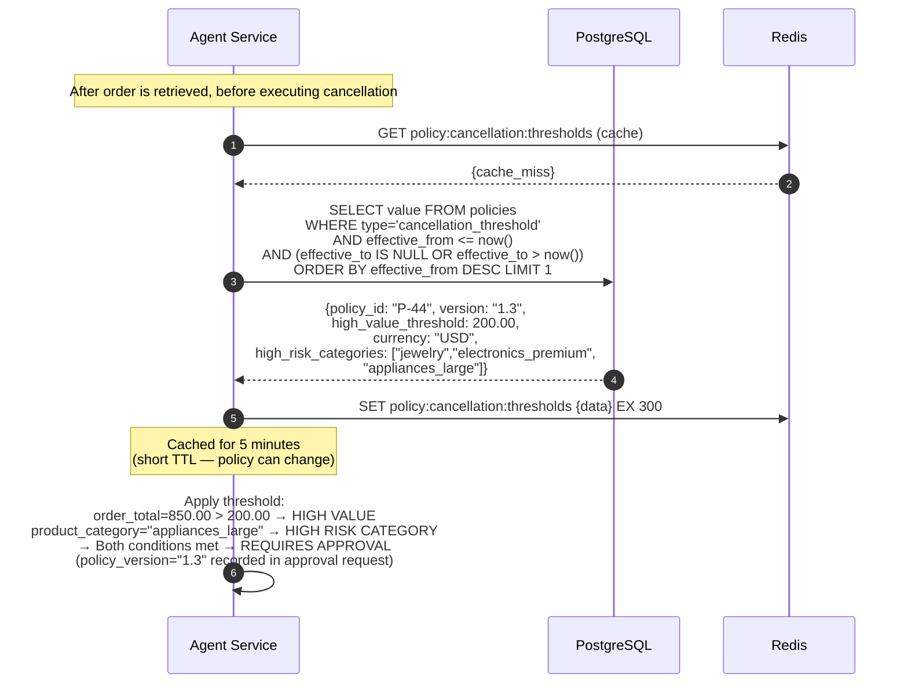

### 6.2 Key Difference from UC-04

```
UC-04 Refund:    Refund always requires approval (hard rule)
UC-05 Cancel:    Threshold loaded from policy store at runtime
                 ┌──────────────────────────────────────────────────┐
                 │  order_total > policy.high_value_threshold        │
                 │  OR                                              │
                 │  product_category IN policy.high_risk_categories  │
                 │  → requires approval                             │
                 │                                                  │
                 │  order_total <= threshold                         │
                 │  AND product_category NOT IN high_risk           │
                 │  → direct execution (out of scope for this UC)   │
                 └──────────────────────────────────────────────────┘

Fail-safe: If policy store is unavailable → treat as HIGH VALUE → require approval
```

---

## 7. Flow 5 — Account / Security Change (UC-06)

Three-phase flow: current-session auth → re-verification through original channel → approval + execution.

### 7.1 Phase 1 — Request and Re-verification Challenge

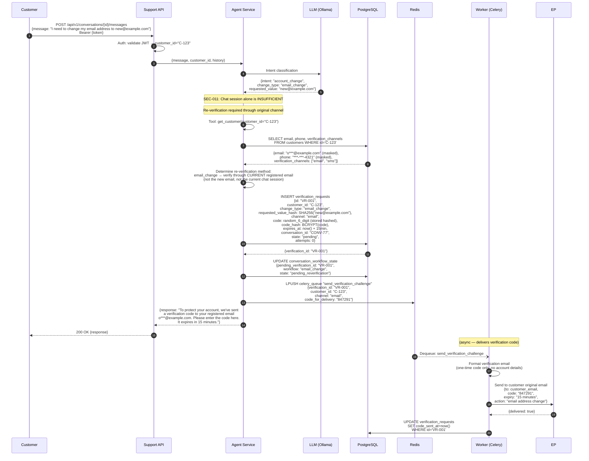

### 7.2 Phase 2 — Customer Submits Code

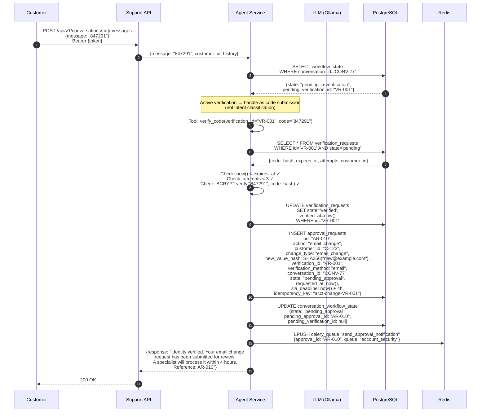

### 7.3 Failed Re-verification

```
Customer submits wrong code:
    ├─ attempts < 3 → increment attempts, return error
    └─ attempts >= 3 → state='failed', deny workflow

Customer does not respond (timeout):
    └─ Celery Beat: check expired verification_requests
       → state='expired'
       → Notify customer: "Verification expired. Please restart the request."
       → No escalation required (customer can retry)

Suspected account takeover:
    → Skip re-verification entirely
    → Immediate escalation to security queue
    → Create high-priority ticket
    → Do not reveal detection criteria
```

---

## 8. Flow 6 — Human Escalation (UC-11)

Handover of the full conversation to a human agent with complete context package.

### 8.1 Sequence Diagram

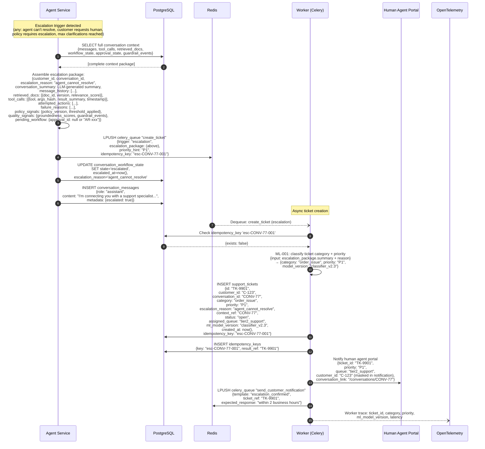

---

## 9. Flow 7 — Knowledge Base Ingestion Pipeline

How Markdown knowledge articles become searchable indexed chunks.

### 9.1 Ingestion Pipeline

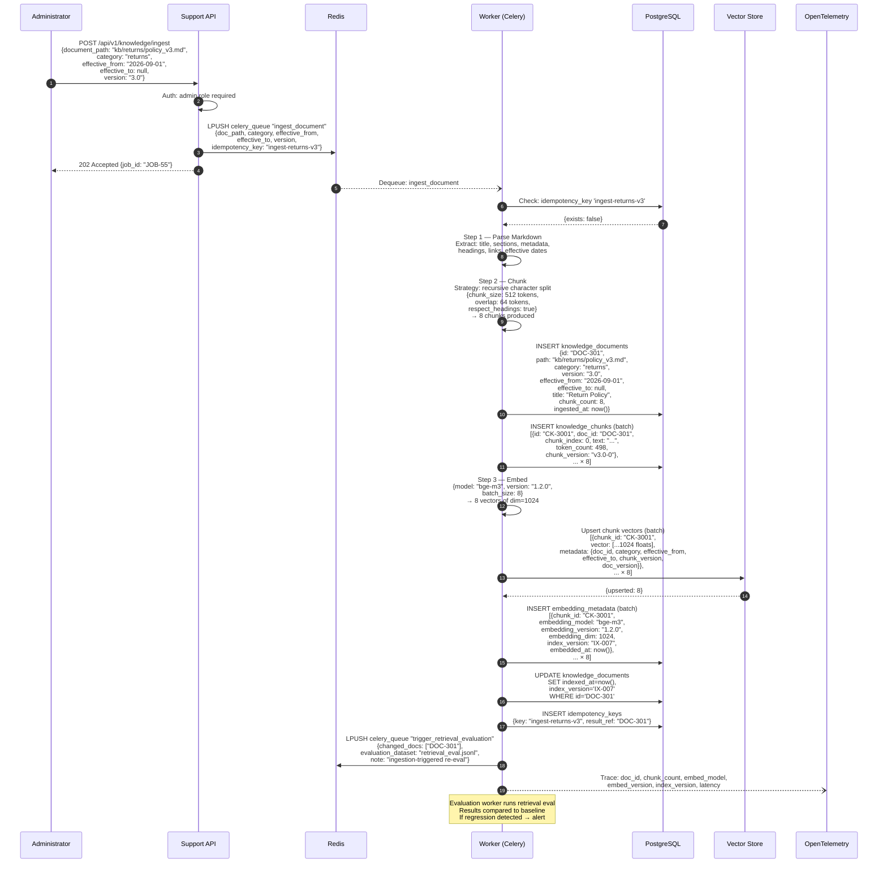

### 9.2 Re-indexing on Embedding Model Change

```
Embedding model updated (e.g., bge-m3 v1.2.0 → v1.3.0)
    │
    ▼
Admin triggers: POST /api/v1/knowledge/reindex
    │
    ▼
Worker: full_reindex task
    ├─ SELECT all knowledge_chunks WHERE indexed_with_model != 'bge-m3-v1.3.0'
    ├─ Re-embed all chunks with new model
    ├─ Upsert new vectors to Vector Store
    ├─ Update embedding_metadata with new model + version
    └─ Trigger retrieval evaluation (required before promotion)
    
Promotion blocked until:
    └─ Retrieval Recall@5 relative regression ≤ 5% vs. baseline
```

---

## 10. Flow 8 — Webhook: Order Event

External order system notifies the platform of order state changes.

### 10.1 Sequence Diagram

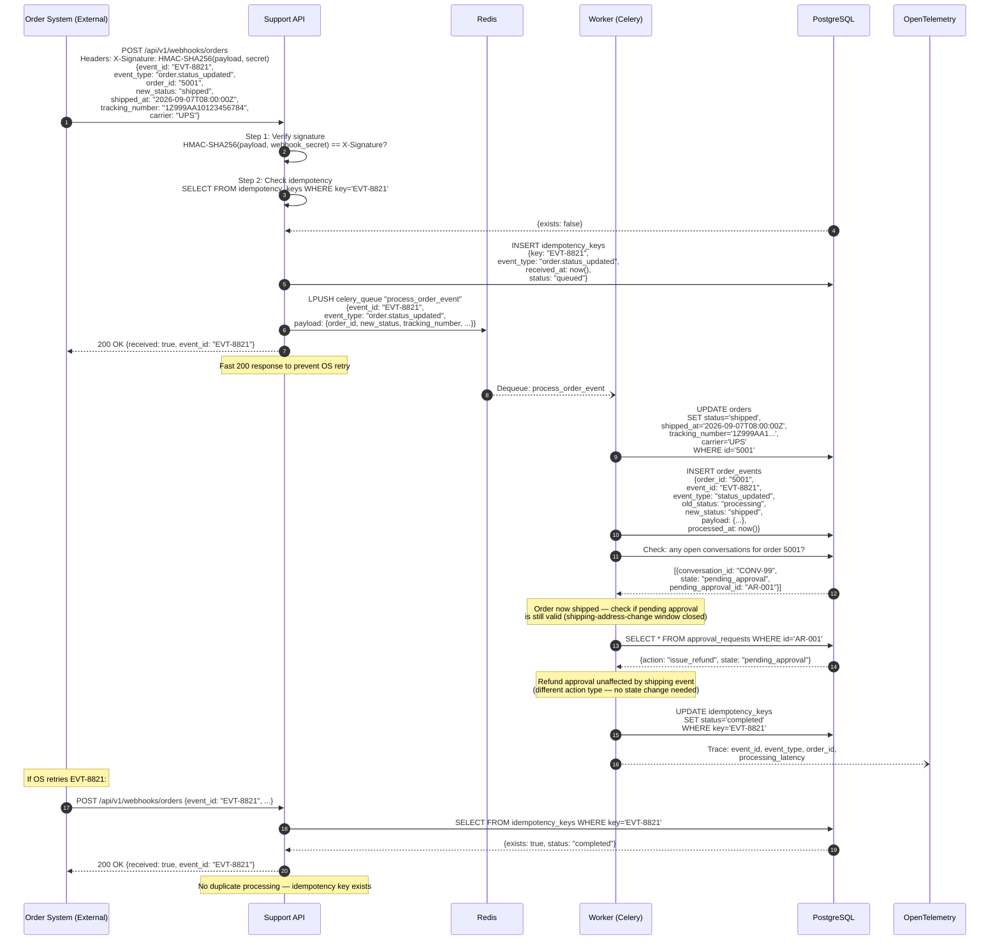

---

## 11. Flow 9 — Evaluation Pipeline (Offline)

How the retrieval and agent evaluation datasets are run and results compared to baseline.

### 11.1 Retrieval Evaluation

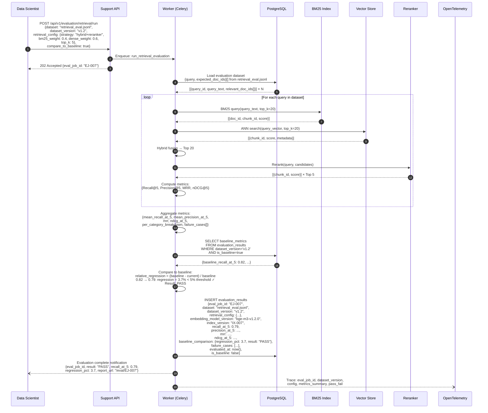

---

## 12. Cross-Cutting Data Flows

### 12.1 PII Masking Flow

PII is masked at write time for logs and traces, and at read time for display contexts.

```
Data enters system (customer message, tool result)
    │
    ├─► Agent processing context (PII present — needed for tools)
    │
    └─► At output boundary:
         ├─ Logs / OTel traces → PII Registry applied → mask before write
         │    {customer_email: "p***@example.com",
         │     customer_phone: "***-***-4321",
         │     address: "[REDACTED]"}
         │
         ├─ Audit records → PII Registry applied → store hashes + masked values
         │    {customer_id: "C-123" (keep — operational),
         │     email_hash: SHA256(email),
         │     email_masked: "p***@example.com"}
         │
         └─ Response to customer → no cross-customer PII ever included

PII Registry (stored in PostgreSQL):
    ├─ customer_name: mask as "J*** D***"
    ├─ email: mask as "p***@domain.com"
    ├─ phone: mask as "***-***-NNNN"
    ├─ address: REDACTED
    ├─ payment_tokens: REDACTED
    └─ order contents: keep (not PII per policy)
```

### 12.2 Idempotency Check Flow

```
Inbound request / event / task
    │
    ▼
Compute idempotency key
    │ Key derivation:
    ├─ API requests:   hash(customer_id + action + order_id + conversation_id)
    ├─ Webhooks:       event_id (provided by sender)
    ├─ Worker tasks:   "task_type-source_id-version"
    └─ Refund exec:    "exec-{approval_id}-v1"
    │
    ▼
PostgreSQL: SELECT FROM idempotency_keys WHERE key=?
    ├─ EXISTS (status=completed)
    │     → Return cached result / 200 OK / skip processing
    │
    └─ NOT EXISTS
          → INSERT key (status=processing)
          → Execute operation
          → UPDATE key (status=completed, result_ref=X)
```

### 12.3 Observability Data Flow

Every interaction produces a structured trace. All services emit to the same OTel collector.

```
All Services
    │ OpenTelemetry SDK (auto-instrumentation + manual spans)
    ▼
OTel Collector
    │
    ├──► Traces backend (Jaeger / Tempo — ADR-010)
    │         └─ Full distributed trace per interaction_id
    │
    ├──► Metrics backend (Prometheus / Grafana — ADR-010)
    │         ├─ api_request_latency_ms (p50, p95, p99)
    │         ├─ agent_step_latency_ms per step
    │         ├─ retrieval_recall_at_5 (from eval runs)
    │         ├─ llm_tokens_in / llm_tokens_out
    │         ├─ tool_call_success_rate per tool
    │         ├─ approval_pending_count
    │         ├─ escalation_rate
    │         └─ automation_rate
    │
    └──► Logs backend (Loki / Elasticsearch — ADR-010)
              ├─ Structured JSON logs
              ├─ PII masked before write
              └─ Level: INFO for normal, ERROR for failures
```

---

## 13. Data Flow Summary — Writes Per Flow

| Flow | PostgreSQL Tables Written | Redis | Vector Store | External |
|---|---|---|---|---|
| UC-01 FAQ | `conversation_messages` | — | Read only | — |
| UC-02 Order Status | `conversation_messages`, `tool_calls` | — | — | — |
| UC-04 Refund (sync) | `approval_requests`, `conversation_workflow_state`, `conversation_messages` | Celery queue | — | — |
| UC-04 Refund (async exec) | `refund_transactions`, `orders`, `approval_requests`, `approval_audit_log`, `idempotency_keys`, `conversation_messages` | Celery queue | — | Email |
| UC-05 Cancellation | same as UC-04 + policy store read | Celery queue | — | — |
| UC-06 Account Change | `verification_requests`, `conversation_workflow_state`, `approval_requests`, `approval_audit_log`, `customers` | Celery queue | — | Email |
| UC-11 Escalation | `conversation_workflow_state`, `conversation_messages`, `support_tickets`, `idempotency_keys` | Celery queue | — | Agent portal |
| UC-12 Ticket | `support_tickets`, `idempotency_keys` | — | — | Agent portal |
| Approval timeout | `approval_requests`, `approval_audit_log`, `support_tickets`, `idempotency_keys` | Celery queue | — | Email |
| Webhook (order) | `orders`, `order_events`, `idempotency_keys` | — | — | — |
| KB Ingestion | `knowledge_documents`, `knowledge_chunks`, `embedding_metadata`, `idempotency_keys` | Celery queue | Chunk vectors upserted | — |
| Retrieval eval | `evaluation_results` | — | Read only | — |

---

## 14. Next Steps

```
Data Flows V1.0 (this document)
         ↓
ADRs — priority order for implementation:
  ADR-001 PostgreSQL (schema derived from flows above)
  ADR-007 Redis + Celery (queue shapes defined above)
  ADR-009 OAuth + JWT (auth flows defined above)
  ADR-005 Workflow Orchestration (state machine derived above)
  ADR-002 Vector Store (query patterns defined above)
         ↓
Database Schema Design
  (tables, constraints, indexes derived from §13 write summary)
         ↓
API Contract Design
  (endpoints, request/response schemas from flows above)
         ↓
Phase 6: Backend Foundation
```

**Key implementation constraints derived from these flows:**

1. `approval_requests` and `conversation_workflow_state` must be in the same PostgreSQL transaction when creating an approval.
2. All Celery tasks processing approvals must check idempotency before any write.
3. The webhook endpoint must respond `200 OK` before enqueuing — never block on processing.
4. Re-verification codes must be stored hashed (bcrypt), never plaintext.
5. Embedding metadata must be inserted atomically with vector store upsert — use a two-phase write with rollback capability.
6. The policy store cache TTL (Redis) must be short (≤ 5 minutes) — policy changes must propagate quickly.
